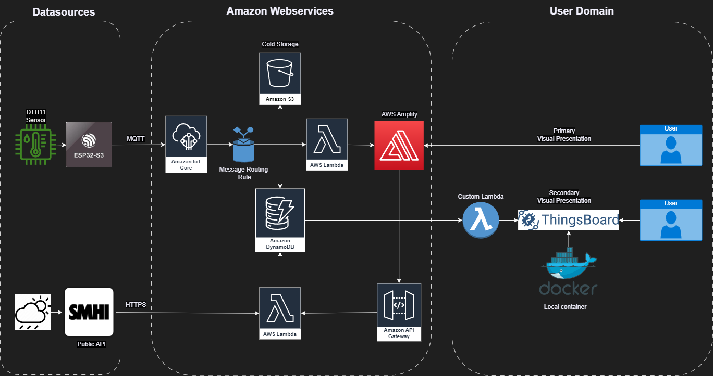
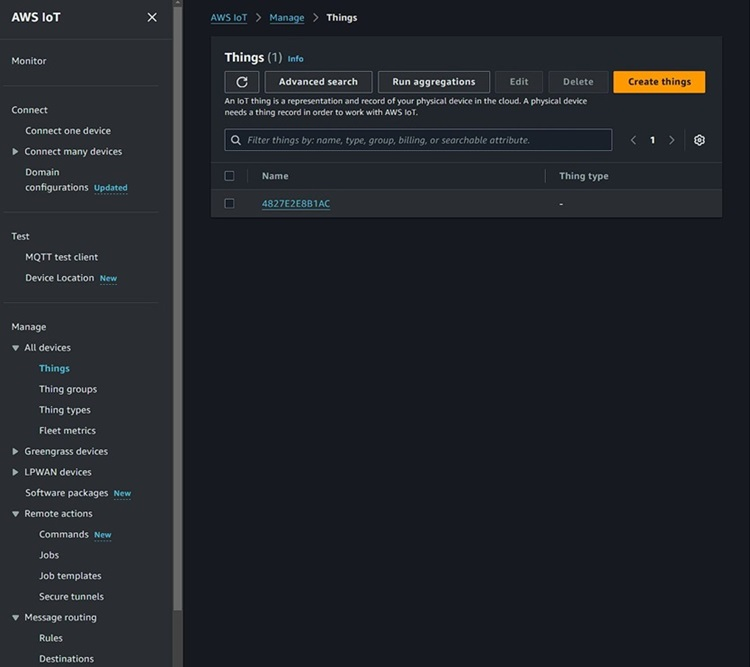
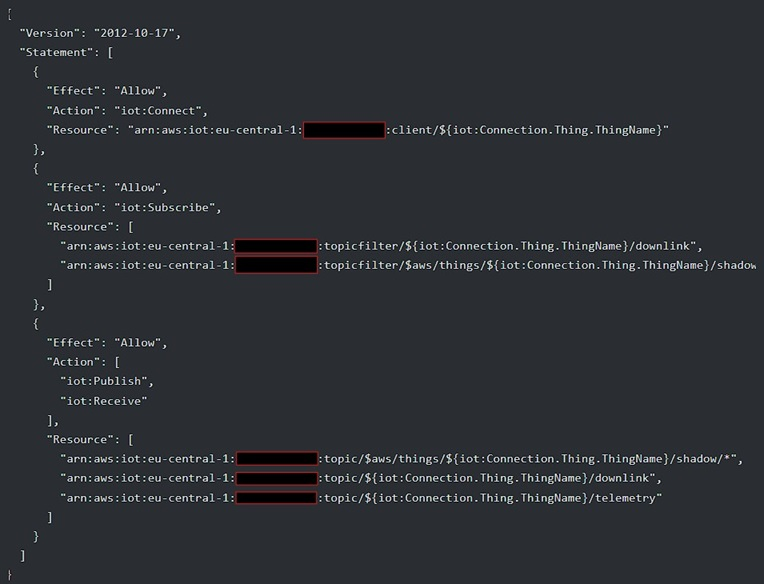
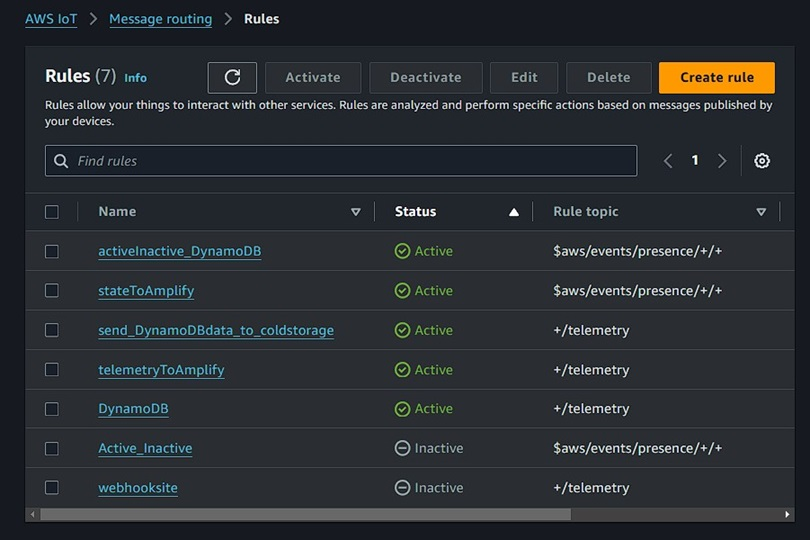
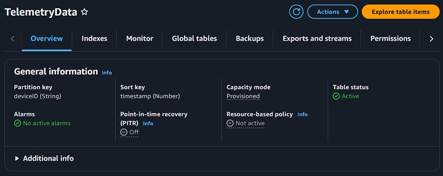
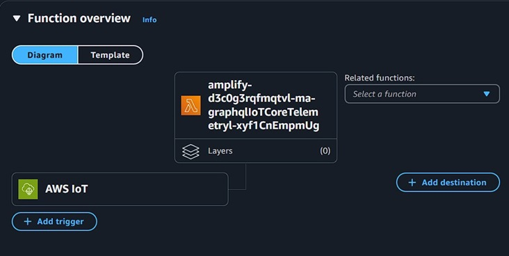
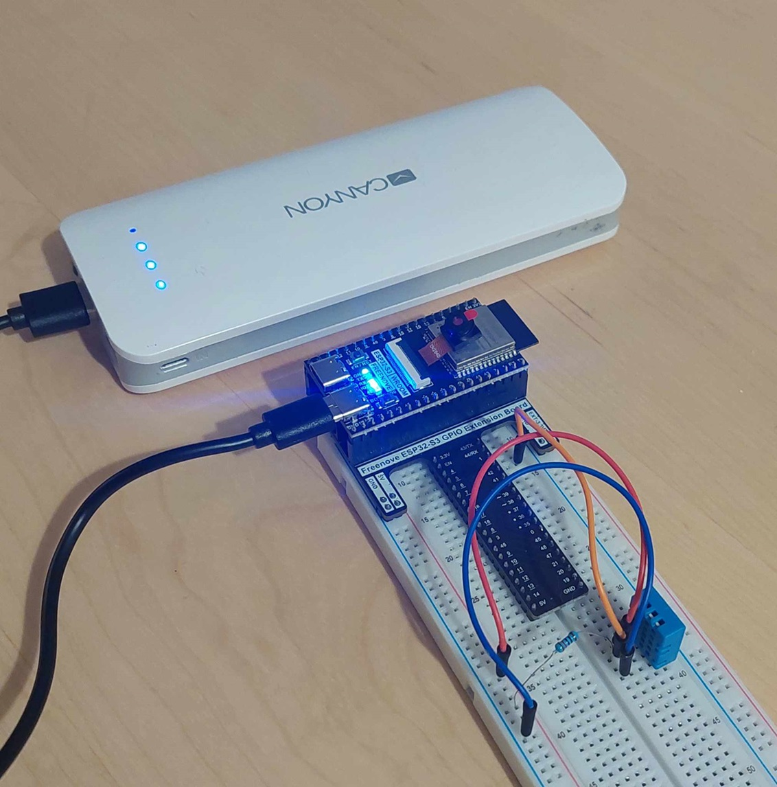
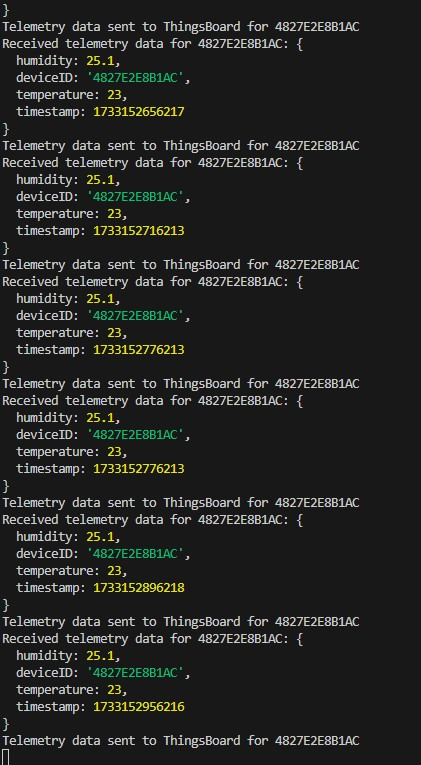
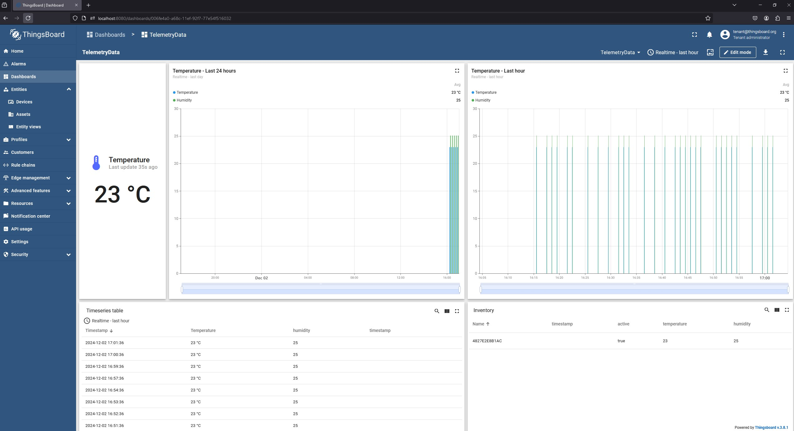

# Cloud Sensor Integration

## Table of Contents

1. [Overview](#overview)
2. [Flowchart](#flowchart)
3. [Hardware](#hardware)
   - [Components](#components)
   - [Connections](#connections)
4. [Software](#software)
   - [Tools and Technologies](#tools-and-technologies)
   - [Codebase](#codebase)
5. [Setup ESP32](#setup-esp32)
   - [ESP32 Firmware Files](#esp32-firmware-files)
   - [Prerequisites](#prerequisites)
   - [Steps](#steps)
6. [Setup AWS](#setup-aws)
   - [Prerequisites](#prerequisites-1)
   - [Steps](#steps-1)
      - [1.1 Create a Thing](#11-create-a-thing)
      - [1.2 Attach Policy](#12-attach-policy)
      - [1.3 Attach Rules](#13-attach-rules)
      - [2. Store Data in DynamoDB](#2-store-data-in-dynamodb)
      - [3. Process Lambda Function](#3-process-lambda-function)
7. [Visualization AWS Amplify](#visualization-aws-amplify)
8. [Visualization ThingsBoard](#visualization-thingsboard)
9. [Security](#security)
10. [Scalability and Future Improvements](#scalability-and-future-improvements)
11. [Examples - Screenshots](#examples---screenshots)
    - [ESP32 Setup](#esp32-setup)
    - [AWS Setup](#aws-setup)
    - [ThingsBoard Setup](#thingsboard-setup)
12. [Sources](#sources)

## Overview

A sensor project utilizing AWS IoT for secure MQTT data transmission, with data visualization and presentation handled by AWS Amplify and ThingsBoard. November 2024.

This project demonstrates how an ESP32 device collects data from a DHT11 sensor, transmits it securely to AWS IoT Core, and makes the data accessible for visualization through two parallel systems:

1. **AWS Amplify**: For real-time data monitoring and a primary user interface, presenting both device and SMHI weather information. Code is present in the [Cloud Sensor Integration Frontend-Amplify repository](https://github.com/PBergstrom90/Cloud_Sensor_Integration_Frontend-Amplify).
2. **ThingsBoard**: For a secondary dashboard using a Dockerized local instance, presenting device information only.

The solution is built to expand and scale, follow security best practices, and integrate with external APIs like the SMHI Open Data API.

## Flowchart

## Hardware

### Components:

- **ESP32-S3 DevKit**: Main microcontroller for transmitting sensor data.
- **DHT11 Sensor**: Captures temperature and humidity data.
- Additional supporting components like resistors, wires, and a breadboard.

### Connections:

- The DHT11 sensor is connected to the ESP32, which reads and transmits the data over MQTT and Wi-Fi.

## Software

### Tools and Technologies:

- **AWS IoT Core**: Handles MQTT communication and message routing.
- **AWS Lambda**: Processes data for storage and API requests.
- **Amazon DynamoDB**: Stores sensor data for long-term persistence.
- **Amazon S3**: Used for any cold storage requirements.
- **AWS Amplify**: Primary user-facing interface for data visualization.
- **ThingsBoard**: A Dockerized instance for additional data visualization.
- **SMHI Open Data API**: Provides external weather data.

### Codebase:

- ESP32 firmware written in C++ (Arduino framework) with MQTT and DHT11 sensor libraries.
- A custom Lambda function for polling AWS for ThingsBoard is written in JavaScript for DynamoDB integration.

## Setup ESP32

### ESP32 Firmware Files

- **`connect.h` & `connect.cpp`**  
  Manages Wi-Fi and AWS IoT Core connections:
  - Establishes secure MQTT communication.
  - Handles device shadow updates and telemetry publishing.
  - Loads certificates from the ESP32 filesystem.

- **`sensor.h` & `sensor.cpp`**  
  Handles data collection from the DHT11 sensor:
  - Reads temperature and humidity data.
  - Validates and sends telemetry to AWS IoT Core.

- **`secrets.h`** *(Not included in the repository)*  
  Stores sensitive credentials:
  - `AWS_IOT_ENDPOINT`, `WIFI_SSID`, and `WIFI_PASSWORD`.

- **`main.cpp`**  
  Main program logic:
  - Initializes components (Wi-Fi, filesystem, sensor).
  - Collects and transmits data every 60 seconds.
  - Handles reconnections and memory monitoring.

### Prerequisites:

1. Install **PlatformIO** in Visual Studio Code.
2. Clone this repository.
3. Place the Amazon-generated certificates (`AmazonRootCA1.pem`, `client-certificate.pem.crt`, `private.pem.key`) in the data/certs folder. This ensures the certificates are uploaded to the ESP32 filesystem during the firmware flashing process.
4. Configure your Wi-Fi credentials (`WIFI_SSID` and `WIFI_PASSWORD`) and AWS IoT Core endpoint (`AWS_IOT_ENDPOINT`) in the ESP32 firmware's `secrets.h` file.

### Steps:

1. Connect the DHT11 sensor to the ESP32 following the wiring diagram.
2. Flash the firmware to the ESP32 using PlatformIO.
3. Monitor the serial console to verify MQTT data transmission.

## Setup AWS

### Prerequisites:

- An active AWS account.
- Permissions to create IoT Core, Lambda, DynamoDB, and Amplify resources.

### Steps:

1. Set up **AWS IoT Core**:
   - Create a thing, certificate, and policy.
   - Set up message routing.
2. Configure **Amazon DynamoDB**:
   - Create a table to store sensor data.
3. Create **AWS Lambda Functions**:
   - One function to process incoming MQTT messages and store them in DynamoDB.
   - Another function to fetch data from DynamoDB and format it for Amplify.
4. Set up **AWS Amplify**:
   - Refer to the linked: [Cloud Sensor Integration Frontend-Amplify repository](https://github.com/PBergstrom90/Cloud_Sensor_Integration_Frontend-Amplify).

#### 1.1 Create a Thing

*“Create a Thing in AWS. Using the individual MAC-adress as identifier of the connected device.”*

#### 1.2 Attach policy

*“Create a Policy for the device, that will be connected to the generated certificates. This is the JSON-version of the policy.”*

#### 1.3 Attach rules

*“Attach message routing-rules, to forward the device data to multiple destinations. Like for example DynamoDB, S3 Cold Storage or an external Webhook-API”*

#### 2. Store data in DynamoDB

*“Create a table in DynamoDB, that uses "deviceID" (thingname) as Partition key and "timestamp" as Sort key.”*

#### 3 Process Lambda Function

*“Use respective Lambda-functions to either fetch data for AWS Amplify, or Thingsboard. This image displays lambda triggered for Amplify”*

## Visualization AWS Amplify

AWS Amplify is the primary visualization platform for this project. All the necessary setup files and instructions can be found in the dedicated repository:
[Cloud Sensor Integration Frontend-Amplify](https://github.com/PBergstrom90/Cloud_Sensor_Integration_Frontend-Amplify)

## Visualization ThingsBoard

1. Set up the Docker container for ThingsBoard. Import the `device.csv` and `telemetrydata.json` files for a basic dashboard and device setup.
2. The `ThingsboardAWSLambda.js` script requires a `.env` file containing the following:  
   - `AWS_FUNCTION_URL` (Link to a `get_latest_telemetry` Lambda function, polling the latest data in DynamoDB).  
   - `AWS_AUTH_TOKEN` (Custom authorization header).  
   - `THINGSBOARD_ACCESS_TOKEN` (Access token for the device currently set up in ThingsBoard).  
   - `THINGSBOARD_BASE_URL` (URL for the ThingsBoard application, usually `http://localhost:8080` while running in a local Docker environment).  
3. Run the `ThingsboardAWSLambda.js` script through the terminal.

## Security

Security is a top priority in this project. The following measures were taken during development:
- MQTT communication is secured with TLS certificates, automatically generated and signed by AWS.
- AWS IAM policies restrict access to resources, granting only relevant permissions.
- Secrets and keys are managed securely in AWS through automatically generated certificates.
- Amplify and ThingsBoard use role-based access controls to prevent unauthorized access.
- The Docker container is currently running in a local environment to avoid unauthorized access, but it can be migrated to AWS with additional configurations.

## Scalability and Future Improvements

- **Multi-sensor support**: Add support for additional sensor types (e.g., CO2, pressure, light, or motion sensors) to diversify the types of telemetry data collected.
- **Connecting multiple devices**: Utilize AWS IoT Fleet Provisioning to securely onboard and manage multiple IoT devices at scale. This will simplify device registration, certificate management, and onboarding for new devices.
- **Improve Integration with external APIs**: Enhance the use of SMHI Open Data by incorporating historical data and weather predictions. Explore integration with other APIs (e.g., OpenWeatherMap) to enrich the system with more context-aware insights.
- **Dynamic threshold monitoring**: Build a system for dynamic threshold alerts using AWS Lambda and Amazon CloudWatch. For instance, notify users if temperature or humidity values deviate significantly from normal ranges.
- **Improved security**: Incorporate AWS IoT Device Defender for monitoring and auditing device behavior to detect potential security vulnerabilities or unexpected behavior.
- **Enchance Cold Storage**: Use Amazon S3 with lifecycle policies to move older data to cost-efficient storage classes like S3 Glacier for long-term retention. Enable versioning to protect against accidental data loss and ensure secure, scalable backups.
- **Enhanced ThingsBoard Integration**: Expand the ThingsBoard dashboard to include advanced visualizations, custom telemetry widgets, and historical data charts. Implement device groups and roles for managing multiple devices efficiently. Leverage ThingsBoard rule chains to trigger alerts, automate responses, and enrich telemetry data with contextual information before visualization.

## Examples - Screenshots

### ESP32 Setup

  
*“ESP32 setup with a DHT11 temperature and humidity sensor connected via a 10kΩ resistor. A portable power bank is temporarily providing power to the ESP32 development board.”*

--

### AWS Setup

### ThingsBoard Setup

  
*“Visual confirmation that .JSON data is being forwarded to ThingsBoard.”*

--

  
*“ThingsBoard dashboard, presenting device data over time.”*

--

## Sources

[SMHI Open Data API](https://opendata.smhi.se/apidocs/metfcst/index.html)

[AWS IoT Core Documentation](https://docs.aws.amazon.com/iot/)